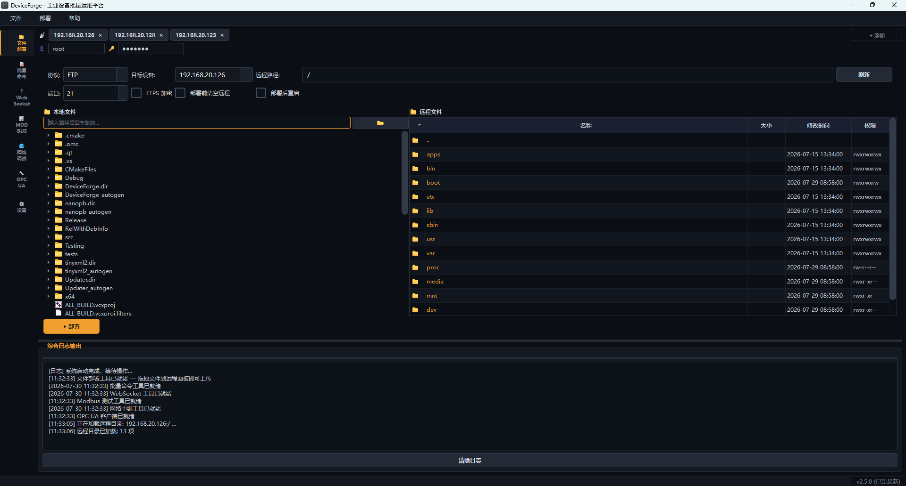
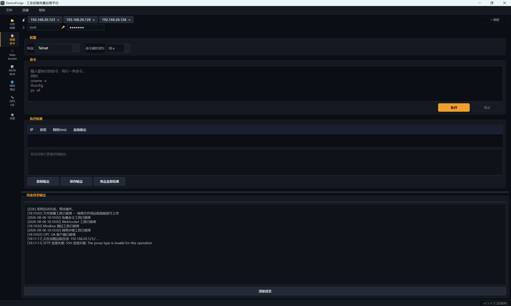
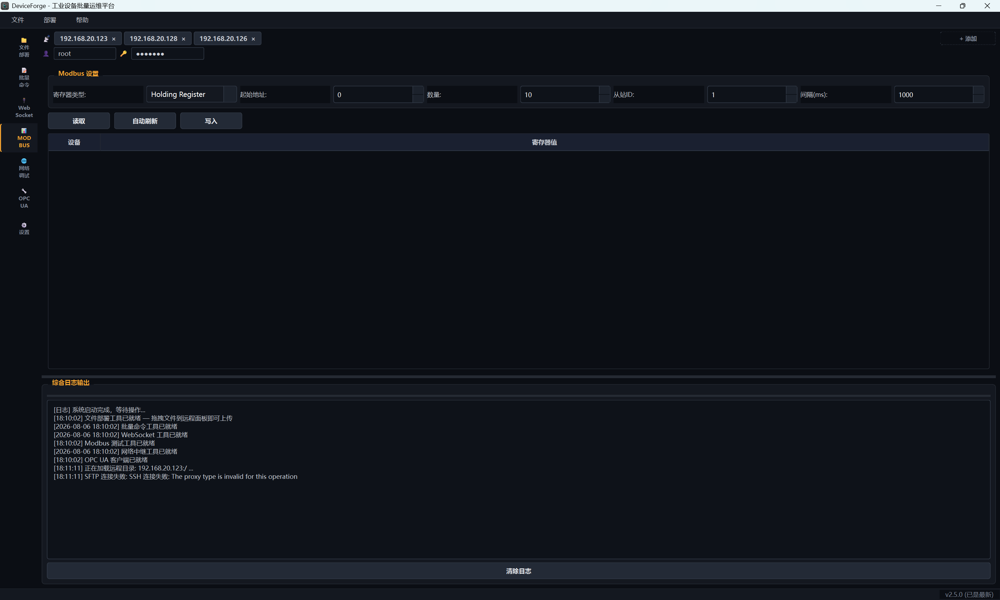
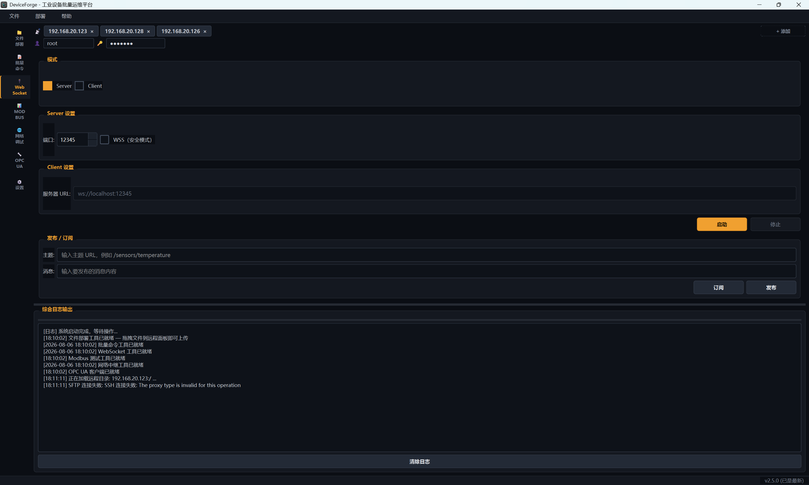
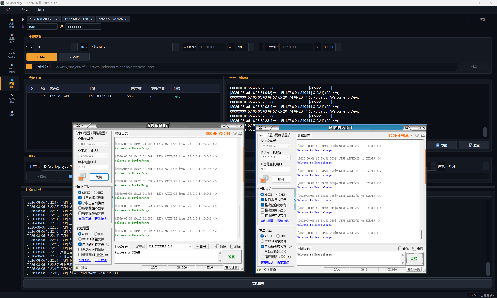
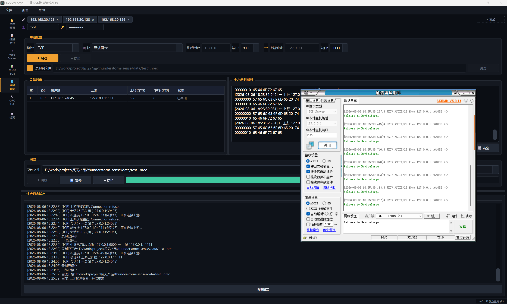
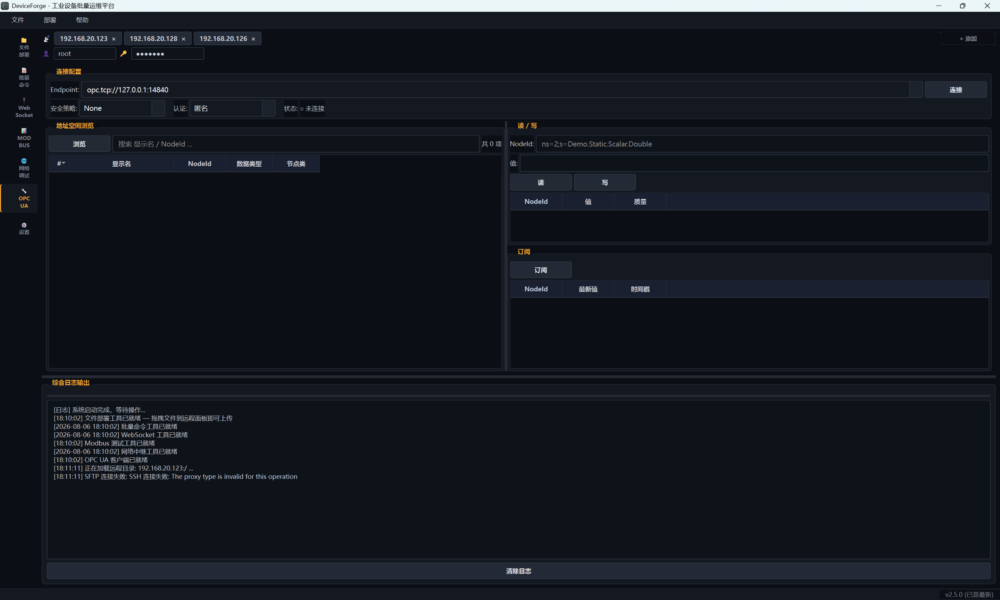

# DeviceForge — 工业级系统部署调试工具

DeviceForge 是基于 Qt 6 + C++17 的**工业级系统部署调试工具**，面向 PLC、嵌入式终端、网络设备等工业硬件的批量部署与运维。原名 DeployMaster，2026-07-05 更名为 DeviceForge。

**版本**：2.6.0 | **许可**：MIT License | **平台**：Windows（Linux 待适配）

---

## ✨ 核心特性

| 特性 | 说明 |
|------|------|
| 📁 **FTP 双栏文件管理器** | 本地 ↔ 远程双栏统一表格视图（TC 化交互：双击导航/路径栏跳转、F2 重命名、F5 复制到对面、F6 移动到对面、Tab 切栏、方向指示），拖拽上传、远程文件管理（删除/重命名/新建目录/下载） |
| 🚀 **多设备批量部署** | 一次操作批量部署到多台设备（逐台执行，失败设备跳过），选择性部署（勾选设备）、部署前清空/部署后重启 |
| 🔒 **FTPS 加密传输** | FTP over TLS，防止凭证和文件在网络中被窃听 |
| 🔌 **SFTP 文件管理 + 批量部署** | SshAdapter SFTP 子系统，双栏 FTP/SFTP 协议一键切换，SFTP 批量部署/拖拽上传（与 FTP 同一部署逻辑） |
| 🎨 **工业仪表盘主题（暗/亮可切换）** | 「琴色是动词」主题体系——琴色仅标记可操作/活跃状态，结构一律中性，暗/亮双主题设置中即时切换 |
| 📋 **设备总线** | 胶囊式设备管理（IP+端口+凭证），ConfigStore 持久化 + DPAPI 加密凭证 |
| 📝 **统一日志** | 所有 Tool 日志统一路由到底部可折叠全局日志面板 |
| 🔁 **网络中继 + 录制回放** | TCP/UDP 透明中继旁路抓包，流量录制为 `.nrec` 并按原始时序回放 |
| 🧩 **可扩展 Tool 架构** | Tool = Backend (ServiceTask) + Widget (QWidget)，新增功能无需修改主窗口 |

---

## 📸 界面截图

| 文件部署（双栏） | 批量命令 |
|----------|----------|
|  |  |

| MODBUS 测试 | WebSocket 通信 |
|-------------|---------------|
|  |  |

| 网络调试（中继） | 网络调试（录制回放） |
|------------------------------|------------------------------|
|  |  |

| OPC UA 客户端 | |
|---------------|---------------|
|  | |

---

## 技术文章

- [我写了一个透明 TCP/UDP 中继调试工具：在不打断生产链路的前提下抓包 + 录制回放](docs/articles/2026-07-09-透明中继调试工具设计.md) — NetRelayTool 设计与实现，透明中继、`.nrec` 录制、按原始时序回放
- [open62541 与 Qt 集成的 5 个陷阱](docs/articles/2026-07-13-opc-ua-open62541-qt-集成陷阱.md) — OPC UA 客户端开发踩坑实录（内存管理/线程安全/编码细节）
- [DeviceForge v2.4：一个工业设备运维工具的现代化历程](docs/articles/2026-07-25-deviceforge-v2.4-现代化工业运维平台.md) — FTP 双栏重构 + 主窗口布局现代化 + 日志统一
- [DeviceForge v2.5：一个工业设备运维工具的现代化历程](docs/articles/2026-08-06-deviceforge-v2.5-现代化工业运维平台.md) — 远程文件管理补完 + SFTP 文件管理 + SylixOS 深度适配，务实推广文
- [DeviceForge v2.6：SFTP 批量部署，从「能浏览」到「能部署」](docs/articles/2026-08-07-deviceforge-v2.6-sftp-deploy.md) — 传输能力补完：SFTP 部署与 FTP 完全对等，IDeployable 接口抽象

---

## 功能模块

| 模块 | 状态 | 协议 | 说明 |
|------|------|------|------|
| 文件部署 | ✅ 双栏文件管理器 | FTP/FTPS (libcurl) | 本地↔远程双栏统一表格视图、双击导航/路径栏跳转、F2 重命名、F5 复制到对面、F6 移动到对面、Tab 切栏、面板间拖拽（方向语义）、多设备批量部署（逐台执行，部署目标=右侧面板当前路径）、选择性部署、目录递归删除、远程重命名/新建目录、远程文件精确对比 |
| SFTP 文件管理 | ✅ 文件管理 + 批量部署 | SFTP (libssh2) | 列目录/上传/下载/删除/重命名/新建目录，双栏协议切换，批量部署（IDeployable 统一部署循环，逐台执行） |
| 批量命令执行 | ✅ Tool 架构 | Telnet / SSH (libssh2) | 批量 Shell 命令，Telnet/SSH 切换，认证失败阻断 |
| WebSocket 通信 | ✅ Tool 架构 | WebSocket | Server/Client，默认 localhost + 可选 Token 认证 |
| Modbus 集群测试 | ✅ Tool 架构 | Modbus TCP | 批量读写寄存器，自动刷新 |
| 网络调试中继 | ✅ Tool 架构 | TCP/UDP/组播 透明代理 | 双向流量中继，Hex+ASCII 实时视图，数据导出，流量录制(.nrec)与按原始时序回放 |
| OPC UA 客户端 | ✅ Tool 架构 | OPC UA (open62541) | 连接(None+匿名)，批量读/写节点，DataChange 订阅，地址空间浏览 |

---

## 技术架构

### 双层架构

```
Qt Shell (Widget)          Framework Layer           Adapter Layer
─────────────────          ─────────────────         ──────────────
NavBar 导航栏               ToolHost (桥接)          IProtocolAdapter
DeviceBusWidget             ToolRegistry (注册表)      ├─ FtpAdapter
QStackedWidget 工作区        ToolBackend (基类)         ├─ TelnetAdapter
darkstyle.qss / darkstyle-light.qss（双主题）  ToolWidget (基类)          ├─ SshAdapter (SFTP)
      ↕                          ↕                    ├─ OpcUaAdapter
  lwmsgq 消息队列            ServiceManager            └─ ProtocolRegistry
      ↕                          ↕                         ↕
  AppState                   ServiceTask               libcurl / libssh2 / QTcpSocket
```

**设计文档**：[架构设计](docs/01-方案设计/2026-07-04-工具框架设计.md) | [实施计划](docs/02-实施计划/2026-07-04-工具框架计划.md) | [FTP 双栏重构设计](docs/01-方案设计/2026-07-25-FTP双栏重构设计.md) | [v2.5 功能补完设计](docs/01-方案设计/2026-07-26-v2.5-ftp-scp-功能补完设计.md)

### 第三方库

| 库 | 用途 |
|----|------|
| lwserverbase | 服务框架（ServiceTask 生命周期 / ConfigManager） |
| lwcommunicate | 网络通信库（TCP/UDP/Serial 连接池 + 自动重连） |
| lwlog | 管道式日志（Filter → Formatter → Appender） |
| lwmsgq | 线程安全消息队列（发布/订阅解耦） |
| lwcomm | 跨平台工具库（文件系统 / Base64 / 字符串 / 时间） |
| tinyxml2 | XML 解析（插件清单 manifest.xml） |
| open62541 | OPC UA 客户端（单文件分发，UA_MULTITHREADING=100） |
| libcurl | FTP/FTPS 文件传输 |
| libssh2 | SSH 命令通道 + SFTP 文件子系统 |
| SQLite | ConfigStore 配置持久化（Qt Sql） |

---

## 快速开始

### 预编译版（推荐）

从 [Releases](../../releases) 下载 `DeviceForge-v2.6.0-win64.zip`，解压后运行 `DeviceForge.exe`。

> 需要安装 [Visual C++ Redistributable](https://aka.ms/vs/17/release/vc_redist.x64.exe)（如已安装 VS2022 可跳过）。
### 从源码构建

```bash
mkdir build && cd build
cmake .. -DCMAKE_PREFIX_PATH="C:\Qt\6.11.1\msvc2022_64"
cmake --build . --config Release
```

或使用一键脚本 `build.bat`（自动清理缓存 + 配置 + 编译）。

### Visual Studio

运行 `build.bat` 后打开生成的 `build/DeviceForge.sln` 即可（旧 `DeployMaster.vcxproj` 已移除，CMake 是唯一构建系统）。

### CI

GitHub Actions（`.github/workflows/msbuild.yml`，workflow 名为 "CMake Build"）：push/PR 到 `main` 时触发，Windows 环境，Qt 6.9.2，CMake + CTest。

---

## 系统要求

| 依赖 | 版本 |
|------|------|
| Qt | 6.11.1（Core/Gui/Widgets/Network/SerialBus/WebSockets/Sql/Concurrent） |
| MSVC | Visual Studio 2022 (v143) |
| CMake | 3.22+ |
| libcurl | 8.16.0（已内置 `lib/libcurl-x64.dll`） |
| 操作系统 | Windows 10/11 x64 |

---

## 项目结构

```
DeviceForge/
├── src/
│   ├── app/             # 应用壳（main.cpp + DeviceForge 主窗口 + .ui/.qrc/.rc + 主题/图标）
│   ├── adapter/         # 协议适配器（FtpAdapter / SshAdapter / TelnetAdapter / OpcUaAdapter / ProtocolRegistry / IDeployable）
│   ├── framework/       # 框架层（ToolBackend / ToolWidget / ToolHost / ToolRegistry / AppState）
│   ├── config/          # 配置持久化（ConfigStore / DpapiCrypto / SettingsDialog）
│   ├── logging/         # LogBridge（Qt → lwlog）
│   ├── ui/              # UI 组件（NavBar / DeviceBusWidget）
│   ├── tools/           # Tool 实现（FtpDeployTool / TelnetTool / WebSocketTool / ModbusTool / NetRelayTool / OpcUaClientTool）
│   ├── updater/         # OTA 在线更新（UpdateChecker / UpdateDialog / Updater.exe）
│   ├── utils/           # 工具类（FormatUtils）
│   └── thirdparty/      # 第三方库
├── docs/                # 文档目录
│   ├── 01-方案设计/      # 设计文档（FTP 双栏 / 布局现代化 / v2.5 功能补完）
│   ├── 02-实施计划/      # 实施计划
│   ├── images/          # 界面截图
│   └── articles/        # 技术文章（发布用）
├── include/curl/        # libcurl 头文件
├── lib/                 # libcurl / libssh2 二进制
├── CMakeLists.txt       # CMake 构建
└── CLAUDE.md            # AI 助手指引
```

---

## 里程碑

| 版本 | 日期 | 内容 |
|------|------|------|
| **2.6.0** | 2026-08-07 | SFTP 批量部署（IDeployable 部署接口 + SshAdapter 递归 mkdir 上传/清空目录/取消 + 部署循环协议化 + UI 解锁 FTP/SFTP 一键切换部署） |
| **2.5.0** | 2026-07-26 | FTP 重命名/新建目录 + 远程精确对比 + SFTP 文件管理 + SylixOS 适配（EPSV/MULTICWD/递归删除） |
| 2.4.0 | 2026-07-26 | FTP 双栏重构 + 布局现代化（NavBar + 胶囊设备栏 + 可折叠日志）+ 日志统一 |
| 2.3.0 | 2026-07-24 | ConfigStore 配置持久化（SQLite + DPAPI）+ OPC UA 订阅卡死修复 |
| 2.2.0 | 2026-07-18 | OTA 在线更新 + 远端预览重构 + CMake 标准构建 |
| 2.1.0 | 2026-07-09 | Modbus Tool 迁移 + NetRelayTool 网络调试中继（录制回放 .nrec）+ SSH 适配器 |
| 2.0.0 | 2026-07-04 | 插件化 Tool 架构 + Protocol Adapter 层 + 工业仪表盘主题 |
| 1.0.0 | 2026-06 | 7 模块功能完整，MVP+EventBus 架构（已废弃） |

[完整变更日志](CHANGELOG.md) · [发展路线图](ROADMAP.md)

---

## 注意事项

- FTP 凭证密码可通过 DPAPI 加密后持久化（SettingsDialog 开启）；未启用时每次启动手动输入
- OPC UA 客户端首期为 None 安全策略 + 匿名认证（无加密）；安全策略加密/证书认证为后续版本
- SFTP 批量部署已支持：协议下拉选 SFTP 即可直接部署/拖拽上传（部署逻辑与 FTP 一致，复用 SSH 通道）
- VS 手动调试时需确保 `libcurl-x64.dll` 在输出目录（CMake 构建已自动处理）
